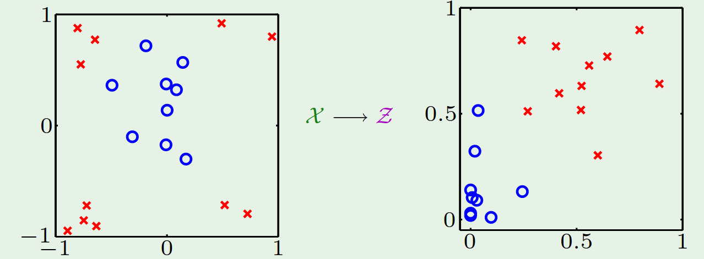
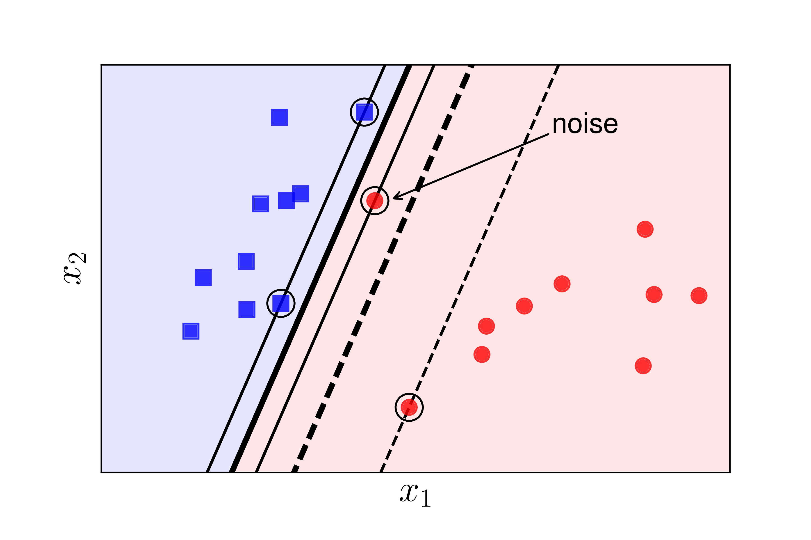

<h1 align="center">NHẬP MÔN HỌC MÁY</h1>

<h2 align="center">Báo cáo đồ án cuối kỳ</h2>

<h1 align="center"> Support vector machine</h1>

| Nhóm 41 | MSSV | Phân công |
|---------|------|-----------|
| Nguyễn Minh Đức | 1712358 | Tìm hiểu, viết báo cáo, training |
| Đặng Thành Duy | 1712379 | Tìm hiểu, coding, training |

<!-- TOC -->

- [1. Tìm hiểu về lý thuyết mô hình SVM (support vector machine)](#1-tìm-hiểu-về-lý-thuyết-mô-hình-svm-support-vector-machine)
  - [1.1 Linear SVM](#11-linear-svm)
    - [1.1.1 Bài toán tối ưu cho Linear SVM](#111-bài-toán-tối-ưu-cho-linear-svm)
    - [1.1.2 Lời giải](#112-lời-giải)
  - [1.2 Non-linear SVM với dữ liệu không khả tách tuyến tính](#12-non-linear-svm-với-dữ-liệu-không-khả-tách-tuyến-tính)
    - [1.2.1 Non linear tranforms](#121-non-linear-tranforms)
    - [1.2.2 Một vài kernel thường dùng](#122-một-vài-kernel-thường-dùng)
    - [1.2.3 Soft margin](#123-soft-margin)
  - [1.3 Bài toán phân loại $K$ lớp $(K>2)$](#13-bài-toán-phân-loại-k-lớp-k2)
- [2. Huấn luyện SVM để phân lớp ảnh chữ số viết tay](#2-huấn-luyện-svm-để-phân-lớp-ảnh-chữ-số-viết-tay)
  - [2.1 Huấn luyện SVM](#21-huấn-luyện-svm)
    - [Kết quả huấn luyện dùng linear kernel](#kết-quả-huấn-luyện-dùng-linear-kernel)
    - [Kết quả huấn luyện dùng Gaussian/RBF kernel](#kết-quả-huấn-luyện-dùng-gaussianrbf-kernel)
  - [2.2 Đánh giá SVM](#22-đánh-giá-svm)

<!-- /TOC -->

## 1. Tìm hiểu về lý thuyết mô hình SVM (support vector machine)

### 1.1 Linear SVM

SVM là một model học có giám sát dùng cho bài toán classification hoặc regression. Linear SVM đi tìm một siêu phẳng phân cách giữa 2 classes, hoặc tìm nhiều siêu phẳng phân cách giữa nhiều classes sao cho khoảng cách từ siêu phẳng đến điểm nearest training-data là lớn nhất.

Khoảng cách từ siêu phẳng đến nearest training-data được gọi là margin của siêu phẳng. Ở hình trên H2 tuy phân chia được 2 classes nhưng có margin nhỏ, được cho là không phân loại tốt bằng H1 với margin lớn nhất.

#### 1.1.1 Bài toán tối ưu cho Linear SVM

Cho một training dataset khả tách tuyến tính gồm n điểm đầu vào:

$$(x_1,y_1), (x_2,y_2),...,(x_i,y_i)$$

Với vector $x_i \in R^d$ có $y_i$ là label tương ứng.

Label của dữ liệu được xác định bởi $y_i = 1$ (class 1) hoặc $y_i = -1$ (class -1)

Theo PLA ta có thể tìm được một ma trận trọng số $w$ và một vector bias $b$ sao cho 
$sign ( w^T*x_i + b ) = y_i$ với mọi $x_i$ thuộc training dataset.

Khi đó $w^T*x + b = 0$ là một siêu phẳng phân chia 2 classes. $w^T$ đóng vai trò là vector pháp tuyến của siêu phẳng. 

Các điểm màu xanh dương thể hiện data thuộc class 1, màu xanh lục thể hiện data thuộc class -1

Các data $x$  nằm trên siêu phẳng có giá trị 0.

Theo đó ta có thể scale $w$ và $b$ cho một hệ số bất kỳ mà vẫn không làm thay đổi kết quả phân loại. SVM normalize $w$ và $b$ sao cho điểm gần siêu phẳng nhất ($x_n$) thỏa

$$|w^T*x_n+b|=1$$

Mục tiêu của SVM là xác định siêu phẳng có khoảng cách từ $x_n$ tới siêu phẳng là lớn nhất.

Lấy một vector $x$ bất kỳ trong siêu phẳng, khi đó khoảng cách từ $x_n$ tới siêu phẳng (margin) được xác định bằng cách tính độ dài của hình chiếu hiệu vector $x_n-x$ lên vector pháp tuyến đơn vị.

Một vector pháp tuyến đơn vị có thể được xác định qua $w$ 

$$\hat{w} = \frac{w}{||w||}$$

Khoảng cách từ $x_n$ tới siêu phẳng bằng

$$=> distance = |\hat{w}*(x_n-x)|$$

Biến đổi một chút

$$ distance = \frac{1}{||\hat{w}||}|w^Tx_n-w^Tx| = \frac{1}{||\hat{w}||}|w^Tx_n+b-w^Tx-b| = \frac{1}{||\hat{w}||}$$

Từ đó ta có bài toán maximize $distance: \frac{1}{||\hat{w}||}$ ở trên, với ràng buộc là điểm gần siêu phẳng nhất $x_n$ thỏa $|w^Tx_n+b|=1$

Chú ý rằng: $|w^Tx_n+b| = y_n(w^Tx_n+b)$, bài toán ở trên trở thành bài toán:

Minimize

$$\frac{1}{2}w^Tw$$

Với ràng buộc

$$y_n(w^Tx_n+b) \geq 1, n = 1,2,...,N$$

#### 1.1.2 Lời giải

Bài toán tối ưu có ràng buộc, chúng ta sẽ nghĩ ngay đến phương pháp nhân tử Lagrange. Phần minimize là một hàm bậc 2 và các ràng buộc là tuyến tính, chứng tỏ bài toán có nghiệm tối ưu $\implies$, tồn tài một siêu phẳng phân cách có margin lớn nhất.

SVM giải bài toán optimize trên bằng đối ngẫu Lagrange (Dual Lagrange) như sau:

Minimize

$$\mathcal{L}(w,b,\alpha) = \frac{1}{2}w^Tw-\sum_{n=1}^{N}\alpha_n(y_n(w^Tx_n+b)-1)$$

with respect to $w$ và $b$, đồng thời maximize with respect to các $\alpha_n \geq 0$

Cho các đạo hàm bậc nhất bằng 0, ta có:

$$ \nabla(w) \mathcal{L} = w - \sum_{n=1}^N \alpha_n y_n x_n = 0$$

$$\frac{\partial {\mathcal{L}}}{\partial b} = - \sum_{n=1}^N \alpha_n y_n  = 0$$

Thay thế 

$$ w = \sum_{n=1}^N \alpha_n y_n x_n$$

và 

$$ - \sum_{n=1}^N \alpha_n y_n  = 0$$

vào biểu thức Lagrange, thu được

$$\mathcal{L}(\alpha) = \sum_{n=1}^{N}\alpha_n - \frac{1}{2}\sum_{n=1}^{N}\sum_{m=1}^N y_n y_m \alpha_n \alpha_m x^T_n x_m$$

Maximize biểu thức trên with respect to $\alpha_n \geq 0$ với $n = 1,...,N$ và $\sum_{n-1}^N \alpha_n y_n = 0$

Bài toán trên được giải quyết bằng quadratic programming

$$\min_{\alpha} \frac{1}{2} \alpha^T \left[ \begin{array}{l}
    y_1y_1 x^T_1 x_1 & y_1y_1x^T_1x_2 & ... & y_1y_Nx^T_1x_N \\
    y_1y_1 x^T_1 x_1 & y_1y_1x^T_1x_2 & ... & y_1y_Nx^T_1x_N \\
    ... & ... & ... & ... \\
    y_1y_1 x^T_1 x_1 & y_1y_1x^T_1x_2 & ... & y_1y_Nx^T_1x_N \\
 \end{array} \right]
 \alpha + (-1^T)\alpha$$

 với ràng buộc $y^T\alpha = 0$ và $\alpha > 0$

 Khi có được lời giải từ quadratic programming 

 $$\alpha = \alpha_1,...,\alpha_N$$

 Ta tính được $w$

 $$w = \sum_{n=1}^N \alpha_ny_nx_n$$

Vì luôn tồn tại các điểm $x_n$ (các điểm gần siêu phẳng nhất) thỏa 

$$\alpha_n(y_n(w^Tx_n+b)-1) = 0$$

Các điểm $x_n$ như vậy được gọi là các support vector

Như vậy, ta chỉ cần các support vector này để tính $w$ và $b$

$$ w = \sum_{x_n is SV} \alpha_ny_nx_n $$

Dùng một support vector bất kỳ để giải cho $b$ dùng phương trình

$$y_n(w^Tx_n+b)=1$$

Với việc chỉ dùng một ít vector (so sánh với tổng số $N$ điểm dữ liệu) dẫn tới khả năng tổng quát hóa của SVM rất lớn

$$E[E_{out}] \leq \frac{E[number \space of \space SV's]}{N-1}$$

### 1.2 Non-linear SVM với dữ liệu không khả tách tuyến tính

#### 1.2.1 Non linear tranforms

Với các dữ liệu không khả tách tuyến tính, SVM sử dụng một biến đổi dữ liệu

$$z_n = \phi(x_n)$$

Được gọi là kernel giúp mapping một điểm trong không gian $X$ với một điểm trong không gian $Z$

Tới đây SVM phân tách dữ liệu ở số chiều cao hơn, nhưng các bước tìm lời giải optimal vẫn giữ nguyên, chỉ thay $x$ bởi $z$ ở biểu thức Lagrange

$$\mathcal{L}(\alpha) = \sum_{n=1}^{N}\alpha_n - \frac{1}{2}\sum_{n=1}^{N}\sum_{m=1}^N y_n y_m \alpha_n \alpha_m z^T_n z_m$$

Khi số chiều của $z_n$ lớn, việc tính toán sẽ trở nên khó khăn, mặt khác chúng ta chỉ cần tính giá trị của inner product $z^T_nz_m$ giữa 2 điểm dữ liệu khác nhau trong gian $Z$.

The `kernel trick` giúp chúng ta tính thẳng giá trị của inner product trên trong không gian $X$ mà không cần biến đổi dữ liệu lên không gian $Z$

$$z^T_nz_m = K(x^T_nx_m)$$

#### 1.2.2 Một vài kernel thường dùng

- Polynomial kernel

$$ K(x,x') = (1+x^Tx')^Q$$

- Gaussian/RBF kernel

$$K(x,x') = e^{-\gamma {||x-x'||}^2}$$

Khi $\gamma$ lớn, SVM model có training error giảm, nhưng có thể dẫn tới overfit

Khi $\gamma$ nhỏ, SVM model dễ bị underfit.

#### 1.2.3 Soft margin

Khi dữ liệu có nhiễu hoặc gần linearly separable, SVM bình thường hoạt động sẽ không hiệu quả:

Khi đó phần biên margin nét đứt vẫn còn hoạt động khá tốt (phân loại được gần hết các điểm dữ liệu) được gọi là soft margin. Theo cách này, SVM thuần được gọi là hard margin.

Soft margin chấp nhận một số điểm dữ liệu không thỏa

$$y_n(w^Tx_n+b) \geq 1$$

Tức tồn tại một giá trị vi phạm $\xi_n \geq 0$ để 

$$y_n(w^Tx_n+b) \geq 1 - \xi_n$$

Tổng vi phạm bằng $\sum_{n=1}^N \xi_n$

Ta nhân tổng vi phạm với một siêu tham số $C$, từ đó đưa về bài toán tối ưu

Minimize:

$$\frac{1}{2}w^Tw+C\sum_{n=1}^N \xi_n$$

với ràng buộc

$$y_n(w^Tx_n+b) \geq 1 - \xi_n \qquad  với \space n=1,...,N$$

và 

$$\xi_n \geq 0 \qquad với \space n=1,...,N$$

Dùng biểu thức Lagrange để giải bài toán tối ưu có ràng buộc trên

$$\mathcal{L}(w,b,\xi,\alpha,\beta) = \frac{1}{2}w^Tw+C\sum_{n=1}^N \xi_n - \sum_{n=1}^N \alpha_n(y_n(w^Tx_n+b)-1+\xi_n)-\sum_{n=1}^N \beta_n \xi_n$$

Minimize with respect to $w$,$b$ và $\xi$

Maximize with respect to các $\alpha_n \geq 0$ và $\beta_n \geq 0$

Tương tự như bài toán đối ngẫu ban đầu, ta lấy đạo hàm bậc nhất theo $w$, $b$ và $\xi$, cho bằng 0, rồi thay thế vào biểu Lagrange được kết quả như sau

Bài toán trở thành bài toán maximize with respect to $\alpha$

$$\mathcal{L}(\alpha) = \sum_{n=1}^{N}\alpha_n - \frac{1}{2}\sum_{n=1}^{N}\sum_{m=1}^N y_n y_m \alpha_n \alpha_m x^T_n x_m$$

với ràng buộc 

$$ 0 \leq \alpha_n \leq C \qquad với \space n=1,...,N$$

và 

$$\sum_{n=1}^N \alpha_ny_n=0$$

Giải bài toán trên tìm được $\alpha$, từ đó tính được vector trọng số:

$$w = \sum_{n=1}^N \alpha_n y_n x_n$$

Để có margin lớn hơn, ta cần phải hi sinh một vài điểm dữ liệu.

Vai trò của $C$, từ biểu thức minimize

$$\frac{1}{2}w^Tw+C\sum_{n=1}^N \xi_n$$

Ta thấy rằng $C$ chỉ sự đánh đổi giữa margin và sự hi sinh. Khi $C$ nhỏ, thuật toán tập trung vào tăng kích thước margin mà không để ý đến sự hi sinh. Ngược lại khi $C$ lớn, thuật toán tập trung giảm các vi phạm $\sum_{n=1}^N\xi_n$, làm giảm sự hi sinh nhưng đồng thời cũng làm giảm kích thước margin.

### 1.3 Bài toán phân loại $K$ lớp $(K>2)$

Dùng nhiều SVM 2 lớp để phân loại cho $K$ lớp

- Phiên bản one-versus-one: dùng các SVM 2 lớp phân loại cho tất cả các cặp classes. Như vậy sẽ có tất cả $C(K,2) = \frac{K(K-1)}{2}$ SVM classifiers. Khi tiến hành phân loại, điểm dữ liệu được vào tất cả các SVM classifiers để tính điểm (số điểm của class sẽ bằng số lượng SVM classfier ủng hộ class đó), class nào có điểm cao nhất thì phân loại điểm dữ liệu vào class đó. Điểm yếu của phương pháp này là cần số lượng classifier rất lớn.

- Phiên bản one-versus-all: Xây dụng $K$ SVM classifier, SVM classifier thứ $i$ phân loại một điểm dữ liệu thuộc class thứ $i$ hay không (bài toán quyết định, yes or no). Khi một SVM classifier trả lời yes, thì quyết định điểm dữ liệu thuộc vào class đó. Điểm yếu của phương pháp này là nếu có nhiều classifier trả lời yes thì sẽ rất khó quyết định điểm dữ liệu thuộc vào class nào. Nhưng vì yêu cầu số lượng classifier thấp hơn phiên bản one-versus-one rất nhiều nên nếu với dữ liệu phân tách khá rõ ràng, ta nên sử dụng one-versus-all.

## 2. Huấn luyện SVM để phân lớp ảnh chữ số viết tay

### 2.1 Huấn luyện SVM

#### Kết quả huấn luyện dùng linear kernel

| C | Training error | Validation error | Training time |
|---|----------------|------------------|--------------|
| 0.001 | 0.07610 | 0.06910 | 16m:00s |
| 0.01 | 0.05594 | 0.05630 | 07m:45s |
| `0.1` | `0.04188` | `0.05190` | `05m:42s` |
| 1 | 0.02754 | 0.05770 | 06m:56s |
| 10 | 0.01692 | 0.07160 | 09m:42s |
| 100 | 0.01300 | 0.07770 | 23m:14s |

Validation error đạt cực tiểu bằng `0.05190` khi $C=0.1$

Khi $C$ tăng thì Training error giảm, validation error cũng giảm theo nhưng đạt đến một mức nhất định (khi $C=0.1$) thì validation error đang giảm sẽ tăng trở lại. Thời gian train cũng tăng giảm theo validation error.

#### Kết quả huấn luyện dùng Gaussian/RBF kernel

| C | $\gamma$ | Training error | Validation error | Training time |
|---|----------|----------------|------------------|--------------|
| 0.001 | 0.001 | 0.88644 | 0.89360 | 01h:45m:57s |
| `0.001` | `0.01` | `0.47486` | `0.45960` | `01h:44m:07s` |
| 0.001 | 0.1 | 0.88644 | 0.89360 | 01h:38m:53s |
| 0.001 | 1 | 0.88644 | 0.89360 | 01h:37m:50s |
| 0.001 | 10 | 0.88644 | 0.89360 | 01h:39m:10s |
| 0.001 | 100 | 0.88644 | 0.89360 | 01h:39m:27s |
|-|-|-|-|-|
| 0.01 | 0.001 | 0.25374 | 0.22790 | 01h:28m:07s |
| `0.01` | `0.01` | `0.09390` | `0.08220` | `00h:47m:17s` |
| 0.01 | 0.1 | 0.78430 | 0.78280 | 01h:55m:29s |
| 0.01 | 1 | 0.88644 | 0.89360 | 02h:04m:28s |
| 0.01 | 10 | 0.88644 | 0.89360 | 02h:06m:18s |
| 0.01 | 100 | 0.88644 | 0.89360 | 01h:59m:27s |
|-|-|-|-|-|
| 0.1 | 0.001 | 0.09824 | 0.08610 | 00h:35m:10s |
| `0.1` | `0.01` | `0.04702` | `0.04220` | `00h:16m:57s` |
| 0.1 | 0.1 | 0.28952 | 0.31250 | 01h:29m:25s |
| 0.1 | 1 | 0.88644 | 0.89360 | 01h:59m:04s |
| 0.1 | 10 | 0.88644 | 0.89360 | 01h:46m:09s |
| 0.1 | 100 | 0.88644 | 0.89360 | 01h:46m:50s |
|-|-|-|-|-|
| 1 | 0.001 | 0.06422 | 0.05890 | 00h:12m:53s |
| `1` | `0.01` | `0.01526` | `0.02230` | `00h:07m:00s` |
| 1 | 0.1 | 0.00004 | 0.04480 | 01h:20m:46s |
| 1 | 1 | 0.00000 | 0.81760 | 01h:50m:37s |
| 1 | 10 | 0.00000 | 0.89360 | 01h:53m:26s |
| 1 | 100 | 0.00000 | 0.89360 | 01h:55m:34s |
|-|-|-|-|-|
| 10 | 0.001 | 0.03794 | 0.04080 | 00h:06m:34s |
| `10` | `0.01` | `0.00058` | `0.01650` | `00h:06m:05s` |
| 10 | 0.1 | 0.00000 | 0.04340 | 01h:27m:42s |
| 10 | 1 | 0.00000 | 0.81380 | 01h:49m:23s |
| 10 | 10 | 0.00000 | 0.89360 | 01h:48m:39s |
| 10 | 100 | 0.00000 | 0.89360 | 01h:47m:48s |
|-|-|-|-|-|
| 100 | 0.001 | 0.00942 | 0.02820 | 00h:05m:15s |
| `100` | `0.01` | `0.00000` | `0.01680` | `00h:05m:42s` |
| 100 | 0.1 | 0.00000 | 0.04340 | 01h:20m:39s |
| 100 | 1 | 0.00000 | 0.81380 | 01h:49m:06s |
| 100 | 10 | 0.00000 | 0.89360 | 01h:49m:53s |
| 100 | 100 | 0.00000 | 0.89360 | 01h:49m:06s |

Khi C tăng thì nhìn chung training error giảm, nhưng validation error lại phụ thuộc khá nhiều vào $\gamma$, khi giữ nguyên C, validation error sẽ hầu như đạt cực tiểu khi $\gamma = 0.01$.

Thời gian training cũng thay đổi tăng giảm theo sự thay đổi của validation error. Chỉ trừ trường hợp C = 0.001, còn lại thời gian training đều đạt cực tiểu cùng với validation error.

### 2.2 Đánh giá SVM

Hàm dự đoán có độ lỗi nhỏ nhất là hàm dùng Gaussian/RBF kernel với $C=10$ và $\gamma = 0.01$. Hàm này đạt ${validation \space error}= 0.01650$

Đo độ lỗi trên tập test

$${test \space error} = 0.018$$

Tập test có lỗi độ $1.8\%$

Đánh giá: hàm dự đoán có độ lỗi phù hợp, lớn hơn trên tập validation một chút, gần bằng giá trị tham khảo được trên [http://yann.lecun.com](http://yann.lecun.com/exdb/mnist/)