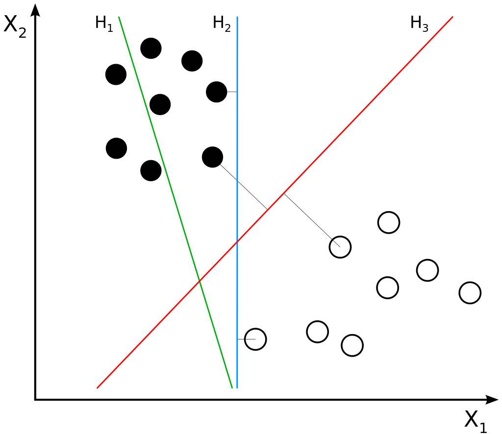

# Support vector machine

## 1. Tìm hiểu về lý thuyết mô hình SVM (support vector machine)

### 1.1 Linear SVM

SVM là một model học có giám sát dùng cho bài toán classification hoặc regression. Linear SVM đi tìm siêu phẳng phân cách giữa 2 classes, hoặc tìm nhiều siêu phẳng phân cách giữa nhiều classes sao cho khoảng cách từ siêu phẳng đến điểm nearest training-data là lớn nhất.

Khoảng cách từ siêu phẳng đến nearest training-data được gọi là margin của siêu phẳng. Ở hình trên H2 tuy phân chia được 2 classes nhưng có margin nhỏ, được cho là không phân loại tốt bằng H1 với margin lớn nhất.

#### 1.1.4 Bài toán tối ưu cho Linear SVM

Cho một training dataset khả tách tuyến tính gồm n điểm đầu vào:

$(x_1,y_1), (x_2,y_2),...,(x_i,y_i)$

Với vector $x_i \in R^d$ có $y_i$ là label tương ứng.

Label của dữ liệu được xác định bởi $y_i = 1$ (class 1) hoặc $y_i = -1$ (class -1)

Theo PLA ta có thể tìm được một ma trận trọng số $w$ và một vector bias $b$ sao cho $sign ( w^T*x_i + b ) = y_i$ với mọi $x_i$ thuộc training dataset.

Khi đó $w^T*x + b = 0$ là một siêu phẳng phân chia 2 classes. $w^T$ đóng vai trò là vector pháp tuyến của siêu phẳng. 

Các điểm màu xanh dương thể hiện data thuộc class 1, màu xanh lục thể hiện data thuộc class -1

Các data $x$  nằm trên siêu phẳng có giá trị 0.

Theo đó ta có thể scale $w$ và $b$ cho một hệ số bất kỳ mà vẫn không làm thay đổi kết quả phân loại. SVM normalize $w$ và $b$ sao cho điểm gần siêu phẳng nhất ($x_n$) thỏa

$|w^T*x_n+b|=1$

Mục tiêu của SVM là xác định siêu phẳng có khoảng cách từ $x_n$ tới siêu phẳng là lớn nhất.

Lấy một vector $x$ bất kỳ trong siêu phẳng, khi đó khoảng cách từ $x_n$ tới siêu phẳng (margin) được xác định bằng cách tính độ dài của hình chiếu hiệu vector $x_n-x$ lên vector pháp tuyến đơn vị.

Một vector pháp tuyến đơn vị có thể được xác định qua $w$  
$\hat{w} = {w}/{||w||}$

$=> distance = |\hat{w}*(x_n-x)|$
#### 1.1.5 Lời giải 

#### 1.1.6 Support vector

### 1.2 Non-linear SVM với dữ liệu không khả tách tuyến tính

#### 1.2.1 Non linear tranforms

### 1.3 Bài toán phân loại K lớp (K>2)

## 2. Huấn luyện SVM để phân lớp ảnh chữ số viết tay

### 2.1 Mô tả dữ liệu

### 2.2 Cài đặt SVM

### 2.3 Huấn luyện SVM

### 2.4 Đánh giá SVM